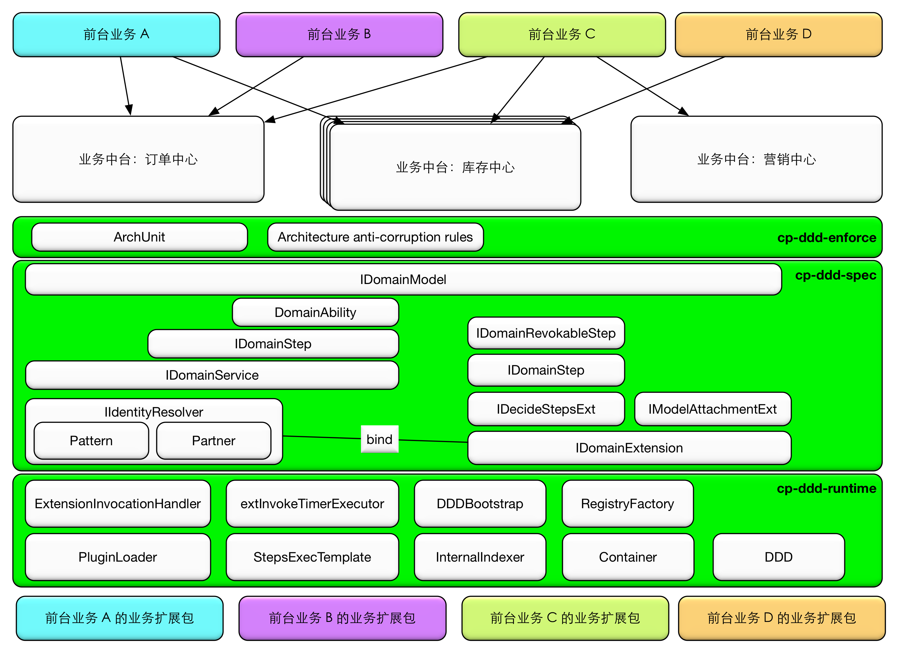

#### **[Quickstart](#quickstart)** • **[Examples](#the-demo)** • **[Landscape](#landscape-of-central-platform)** • **[Chat with us](https://gitter.im/cp-ddd-framework/community)**

[](https://search.maven.org/search?q=g:io.github.dddplus)

[](https://github.com/funkygao/cp-ddd-framework/actions?query=branch%3Amaster+workflow%3ACI)
[](https://lgtm.com/projects/g/funkygao/cp-ddd-framework/context:java)
[](https://codeclimate.com/github/funkygao/cp-ddd-framework/maintainability)
[](https://codecov.io/gh/funkygao/cp-ddd-framework)

[](https://github.com/heynickc/awesome-ddd#jvm)
[](https://www.tickgit.com/browse?repo=github.com/funkygao/cp-ddd-framework)
[](https://gitter.im/cp-ddd-framework/community)

<details>
<summary><b>Table of content</b></summary>

## Table of content
   * [What is DDDplus](#what-is-dddplus)
      * [Current status](#current-status)
      * [Quickstart](#quickstart)
      * [Features](#features)
      * [Modules](#modules)
      * [Key abstractions](#key-abstractions)
      * [Reference documentation](#reference-documentation)
   * [Using DDDplus](#using-dddplus)
      * [Maven](#maven)
      * [Gradle](#gradle)
      * [Building from Source](#building-from-source)
      * [With dddplus-archetype](#with-dddplus-archetype)
   * [The Demo](#the-demo)
   * [DDDplus Ecosystem](#dddplus-ecosystem)
   * [FAQ](#faq)
   * [Landscape of Central Platform](#landscape-of-central-platform)
   * [Contribution](#contribution)
   * [Release Planning](#release-planning)
   * [Licensing](#licensing)

</details>

----

## What is DDDplus?

DDDplus, originally cp-ddd-framework(cp means Central Platform：中台), is a lightweight flexible development framework for complex business architecture.

一套轻量级业务中台开发框架，以[DDD](https://github.com/funkygao/cp-ddd-framework/wiki/DDD)思想为本，致力于业务资产的可沉淀可传承，全方位解决复杂业务场景的扩展问题，实现[中台核心要素](https://github.com/funkygao/cp-ddd-framework/wiki/%E4%B8%9A%E5%8A%A1%E4%B8%AD%E5%8F%B0%E7%9A%84%E6%A0%B8%E5%BF%83%E8%A6%81%E7%B4%A0)，赋能中台建设。

融合了前中台复杂生态协作方法论，充分考虑组织架构、技术债、学习门槛、可演进性、运维成本和风险而开发的，解决[业务开发痛点](https://github.com/funkygao/cp-ddd-framework/wiki/Why-we-need-this-framework)，是中台架构的顶层设计和完整解决方案。

### Current status

Used for several complex critical central platform projects in production environment.

多个复杂的中台核心项目生产环境下使用。

### Quickstart

Please visit [Quickstart](https://github.com/funkygao/cp-ddd-framework/wiki).

### Features

- Based on DDD, but beyond DDD
- 14 key business abstractions cover most complex business scenarios
- Full layered extensibility
- Empowers InnerSource
- Provide maven archetype that generates a DDDplus integrated project
- Total solutions oriented
- Covers business assets full lifecycle

核心特性：
- 以DDD架构思想为本，面向复杂业务场景架构设计
   - 通过代码框架提供足够约束，让DDD不再仅停留在思想层面
   - 只引入弱依赖的 [IDomainModel](dddplus-spec/src/main/java/io/github/dddplus/model/IDomainModel.java)，弱化其他概念，降低DDD上手门槛
   - 提供 [dddplus-archetype](https://github.com/dddplus/dddplus-archetype)，直接生成最佳实践的脚手架代码
   - DDD分层架构上增加一层`spec layer`，解决前中台协同问题
- 14个核心业务抽象(常用9个)，勾勒出业务中台骨架
   - 中台架构的顶层设计
   - less is more，以不变应万变
   - 研发专注于填空式开发，解决局部问题
- 全方位解决业务的不确定性
   - 业务逻辑、流程、逻辑模型、数据模型的扩展、多态体系
   - 框架本身支持再次扩展
   - 抽象出独立的业务扩展包，框架底层通过`ClassLoader`机制进行业务隔离，支持不重启热更新
- 支撑中台战略的复杂生态协作
   - 前台、中台解耦
   - 业务隔离，不同前台间业务隔离，前台和中台隔离
   - 支持稳态、敏态双速应用
   - InnerSource，生态合作协同机制
- 完整的解决方案
   - 业务能力演化，业务测试，最佳实践，架构持续防腐，重构的导流验证，绞杀者落地方案等
   - 提供 [一套完整的Demo工程](https://github.com/dddplus/dddplus-demo)
   - 演示 [5分钟搭建一个仓储中台WMS](https://github.com/dddplus/dddplus-archetype-demo)，手把手真实场景教学
- 覆盖业务资产的全生命周期
  - 开发，测试，发布，运维，业务运营

### Modules

```
dddplus
   ├── dddplus-spec    - Specification of DDDplus
   ├── dddplus-runtime - Runtime implementation
   ├── dddplus-plugin  - Plugin jar hot reloading mechanism
   ├── dddplus-unit    - Extra unit test facilities
   ├── dddplus-enforce - Enforce expected evolvement of the business architecture
   └── dddplus-test    - Fully covered unit test cases
```

### Key abstractions


### Reference documentation

Please visit [Javadoc](https://funkygao.github.io/cp-ddd-framework/doc/apidocs/).

## Using DDDplus

已推送至[Maven中央库](https://search.maven.org/search?q=g:io.github.dddplus)，可直接引入。

### Maven

```xml
<properties>
    <dddplus.version>1.0.2</dddplus.version>
</properties>

<dependency>
    <groupId>io.github.dddplus</groupId>
    <artifactId>dddplus-runtime</artifactId>
    <version>${dddplus.version}</version>
</dependency>
```

### Gradle

```groovy
dependencies {
    ...
    compile 'io.github.dddplus:dddplus-runtime:1.0.2'
}
```

### Building from Source

``` bash
git clone https://github.com/funkygao/cp-ddd-framework.git
cd cp-ddd-framework/
mvn install # will run all test cases
```

### With dddplus-archetype

``` bash
mvn archetype:generate                          \
    -DarchetypeGroupId=io.github.dddplus        \
    -DarchetypeArtifactId=dddplus-archetype     \
    -DarchetypeVersion=1.0.2                    \
    -DgroupId=com.foo -DartifactId=demo         \
    -Dpackage=com.foo -Dversion=1.0.0-SNAPSHOT  \
    -B
```

For more, please visit [dddplus-archetype project](https://github.com/dddplus/dddplus-archetype).

## The Demo

Please visit [使用该框架搭建`订单履约中台`的例子](https://github.com/dddplus/dddplus-demo).

## DDDplus Ecosystem

- [dddplus-archetype](https://github.com/dddplus/dddplus-archetype)
   - a maven archetype that generate a complete DDDplus driven project skeleton
- [dddplus-visualizer](https://github.com/dddplus/dddplus-visualizer)
   - 借助ANTLR分析Java源代码AST，把零散的业务抽象集中可视化输出
   - written in golang, because it is a CLI

## FAQ

Please visit [FAQ](https://github.com/funkygao/cp-ddd-framework/wiki/FAQ).

## Landscape of Central Platform

业务中台建设全景图。



## Contribution

You are welcome to contribute to the project with pull requests on GitHub.

If you find a bug or want to request a feature, please use the [Issue Tracker](https://github.com/funkygao/cp-ddd-framework/issues).

For any question, you can use [Gitter Chat](https://gitter.im/cp-ddd-framework/community) to ask.

## Release Planning

Interested on when the next release is coming? Check our [release planning](https://github.com/funkygao/cp-ddd-framework/wiki/Release-Planning) document for details.

## Licensing

DDDplus is licensed under the Apache License, Version 2.0 (the "License"); you may not use this project except in compliance with the License. You may obtain a copy of the License at [http://www.apache.org/licenses/LICENSE-2.0](http://www.apache.org/licenses/LICENSE-2.0).
