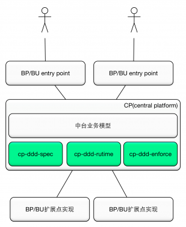

# cp-ddd-framework (cp stands for `Central Platform`：中台)

* [What is cp-ddd-framework](#what-is-cp-ddd-framework)
   * [What problems does it solve](what-problems-does-it-solve)
   * [Key components](#key-components)
   * [BP vs CP](#bp-vs-cp)
* [Requirements](#requirements)
* [Using cp-ddd-framework](#using-cp-ddd-framework)
* [Building from Source](#building-from-source)
* [Roadmap](#roadmap)
* [FAQ](#faq)
* [Licensing](#licensing)

## What is cp-ddd-framework?

以DDD思想为基础，打造业务不确定的业务中台：企业级能力复用平台。

### What problems does it solve

解决了如下问题：
- 业务逻辑的个性化
- 业务流程的个性化
- 业务模型的个性化

### Key components

- layered extension point
- model schema extension
- business steps orchestration
- dynamic loading business extension jar
- isolation of business runtime
- best practice of DDD

### BP vs CP

业务前台与业务中台：



## Requirements

Requires Java 1.8+ and Spring 4.3.12.RELEASE or later.

## Using cp-ddd-framework

See the [cp-ddd-example](cp-ddd-example).

## Building from Source

``` bash
mvn clean install
```

## Roadmap

## FAQ

## Licensing

cp-ddd-framework is licensed under the Apache License, Version 2.0 (the "License"); you may not use this project except in compliance with the License. You may obtain a copy of the License at [http://www.apache.org/licenses/LICENSE-2.0](http://www.apache.org/licenses/LICENSE-2.0).
