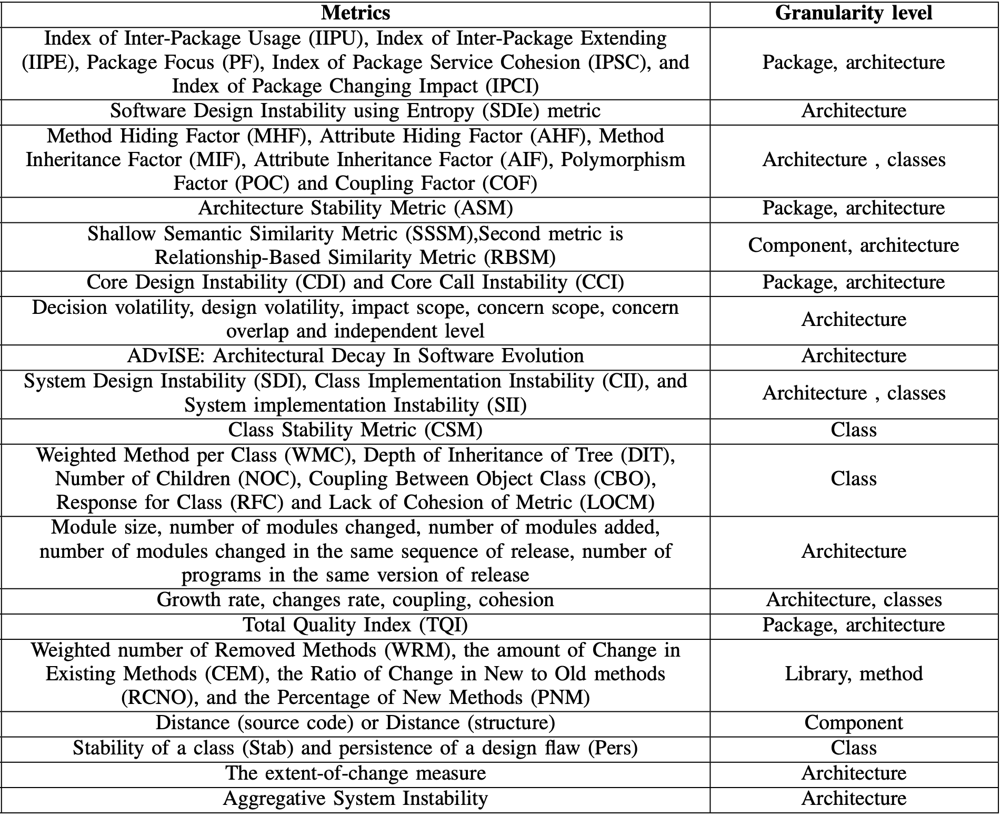
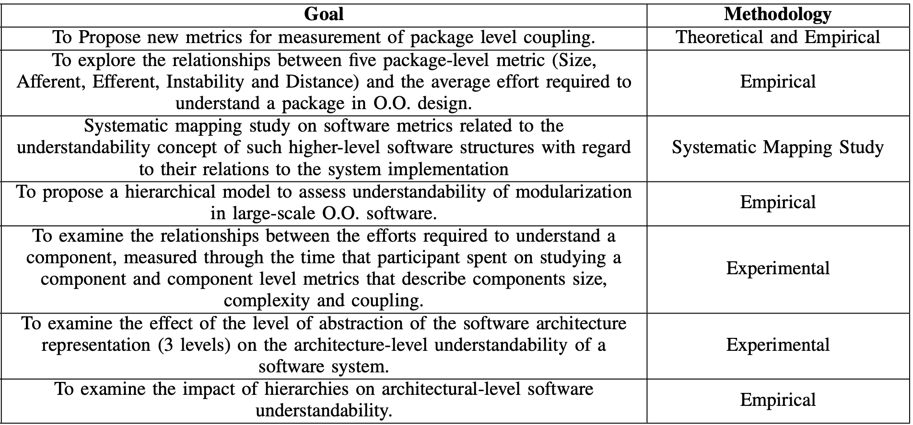

# 软件架构质量度量

>It is not practically possible to specify or measure all subcharacteristics for all parts of a large computer system or software product. The relative importance of quality characteristics will depend on the high-level goals and objectives for the project.

## Overview

## Metrics

## References

- [Software Architecture Quality Measurement Stability and Understandability](https://malenezi.github.io/malenezi/pdfs/Paper_75-Software_Architecture_Quality_Measurement_Stability.pdf)
- [Evaluating the Impact of Object-Oriented Design on Software Quality](https://www.researchgate.net/publication/2818243_Evaluating_the_Impact_of_Object-Oriented_Design_on_Software_Quality)
- [Analysis of Object Oriented Metrics on a Java Application](https://www.researchgate.net/publication/341286837_Analysis_of_Object_Oriented_Metrics_on_a_Java_Application)
- [如何度量软件架构](https://insights.thoughtworks.cn/how-to-measure-software-architecture/)
